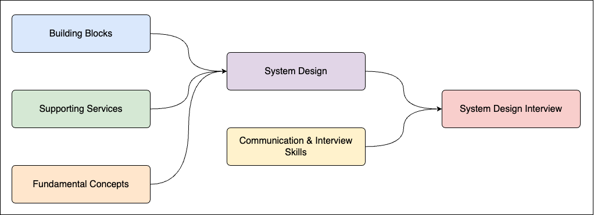
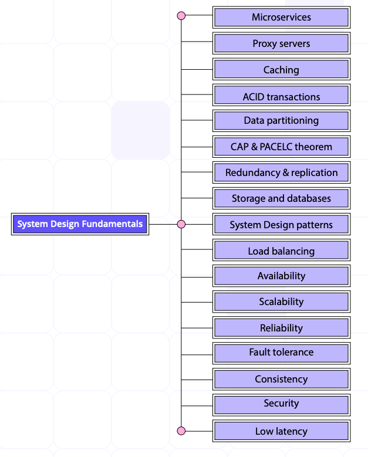
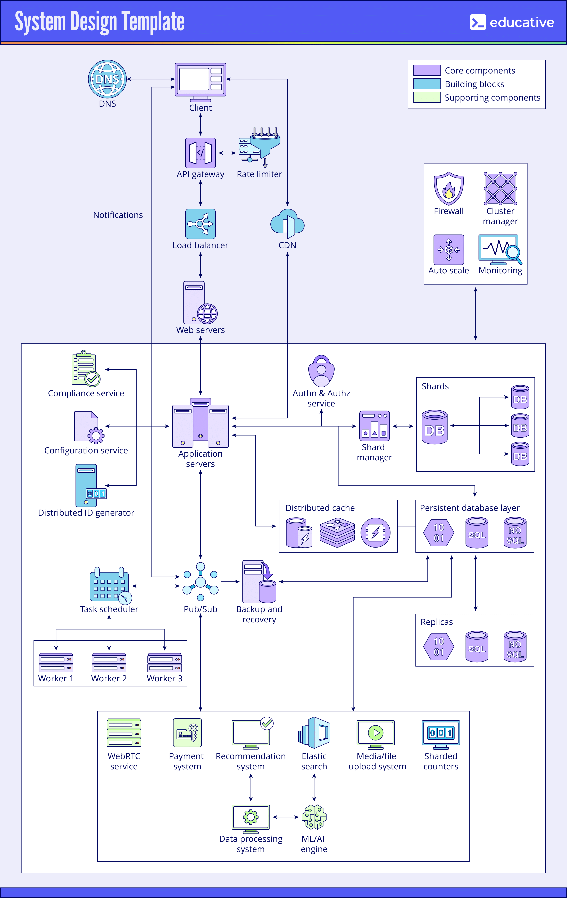

System Design Interview
-----------------------

# Quick Navigation
1. [Introduction](#introduction)
2. [Basics of System Design](#basics-of-system-design)
3. [Core System Design Concepts](#core-system-design-concepts)
4. [Building Blocks](#building-blocks)
5. [Supporting Services](#supporting-services)
6. [System Design Guides](#system-design-guides)
7. [Paths to Study System Design](#paths-to-study-system-design)
8. [FAQs](#faqs)

# Introduction 
This document serves as a comprehensive guide for preparing for system design interviews based on my experience as a software engineer. It features essential components, algorithms, building blocks, supporting services, guides, and courses. The links provided are curated to offer a balanced mix of educational resources and practical insights into designing large-scale real-world systems.

|  | 
|:--:| 
# Basics of System Design

**System Design Interview (SDI)** is a core part of tech interviews at tech giants like Amazon and Netflix. It evaluates a candidate's ability to think beyond the code from a broader perspective. A good candidate will show their technical, leadership, and communication abilities in this technical interview.

-   [What is System Design?](https://www.techopedia.com/definition/29998/system-design)

-   [Why is System Design important for Software Engineers?](https://medium.com/@dezhango/system-design-is-more-important-than-you-think-8213f803ff81)

-   [System Design at the top tech companies: FAANG/MAANG](https://www.educative.io/blog/faang-system-design-interview-guide).

-   [What are the top System Design Interview Questions?](https://www.educative.io/blog/system-design-interview-questions)

**Who Should Prepare for SDI?**\
Primarily, software engineers and engineering managers aiming for roles in tech giants like Amazon, Google, and Netflix should prepare for System Design Interviews. However, anyone involved in software development or architecture could benefit from understanding these concepts.

**What Does SDI Decide?**\
The outcome of an SDI can influence hiring decisions, promotions, and salary negotiations. A successful interview demonstrates a candidate's readiness to tackle complex engineering challenges in real-world scenarios.

# Core System Design Concepts

-   Key Characteristics

    -   [Availability](https://www.enjoyalgorithms.com/blog/availability-system-design-concept/)

    -   [Scalability](https://www.educative.io/answers/scalability-in-system-design)

    -   [Low Latency](https://www.enjoyalgorithms.com/blog/latency-in-system-design/)

    -   [Reliability](https://ganeshprasad227.medium.com/reliability-in-system-design-sde-interview-fc92909ff17b)

    -   [Fault Tolerance](https://www.educative.io/answers/what-is-fault-tolerance)

    -   [Security](https://dev.to/sardarmudassaralikhan/security-in-system-design-and-architecture-hli)

    -   [Consistency](https://medium.com/dotnetcircuit/data-consistency-in-the-realm-of-system-design-c31256a3f4b8)

-   Application and Web Servers

    -   [Understanding Application Servers](https://www.educative.io/answers/web-server-vs-application-server)

-   API Gateway

    -   [API Gateway Explained](https://www.educative.io/answers/what-is-the-role-of-api-gateway-in-microservices-architecture)

-   Worker Servers

    -   [Worker Server Architecture](https://www.geeksforgeeks.org/what-is-a-web-server-working-and-architecture/)

-   Authentication & Authorization

    -   [Auth Basics](https://www.educative.io/answers/what-is-authentication-and-authorization)

-   Database, Caches, Shard Managers

    -   [Database Types](https://www.educative.io/courses/grokking-modern-system-design-interview-for-engineers-managers/types-of-databases)

    -   [Databases: Relational and Non-Relational](https://www.educative.io/api/cheatsheet/5592097457831936/download)

        -   [What are SQL Databases?](https://www.solarwinds.com/resources/it-glossary/sql-database)

        -   [What are NoSQL Databases?](https://www.mongodb.com/resources/basics/databases/nosql-explained)

    -   [What is Data Partitioning?](https://www.cockroachlabs.com/blog/what-is-data-partitioning-and-how-to-do-it-right/)

    -   [What is Database Sharding?](https://www.educative.io/answers/what-is-database-sharding)

    -   [What is Database Replication?](https://www.scylladb.com/glossary/database-replication/)

    -   [Caching Strategies](https://www.educative.io/answers/caching-patterns)

-   Firewalls

    -   [Understanding Firewalls](https://www.educative.io/answers/what-is-a-firewall)

-   Backup and Recovery

    -   [Backup Strategies](https://www.future-processing.com/blog/9-data-backup-strategies-and-techniques/#:~:text=The%203%2D2%2D1%20backup,location%20as%20the%20other%20copies.)

|  | 
|:--:| 
| *Image credits: [educative.io](www.educative.io)* |

# Building Blocks

-   Load Balancers

    -   [Load Balancing Techniques](https://www.educative.io/answers/what-is-a-load-balancer)

-   CDNs

    -   [Content Delivery Networks](https://www.educative.io/answers/what-is-a-content-delivery-network)

-   Rate Limiters

    -   [Fundamentals of Rate Limiting](https://medium.com/@patrikkaura/the-fundamentals-of-rate-limiting-how-it-works-and-why-you-need-it-fd86d39e358d)

-   DNS

    -   [Domain Name System Fundamentals](https://www.educative.io/answers/what-is-dns)

-   Distributed ID Generator

    -   [How does the Unique ID Generator work?](https://blog.devtrovert.com/p/how-to-generate-unique-ids-in-distributed)

-   Task Scheduler

    -   [Task Scheduler Design](https://www.educative.io/courses/system-design-interview-prep-crash-course/design-a-distributed-task-scheduler)

-   Search Indexer

    -   [Search Indexing](https://www.educative.io/courses/grokking-modern-system-design-interview-for-engineers-managers/indexing-in-a-distributed-search)

    -   [Introduction to Elastic Search](https://www.educative.io/courses/elasticsearch-fundamentals-indexing-and-querying-data)

-   Queuing / Pub-Sub

    -   [Message Queuing Basics](https://www.educative.io/courses/grokking-modern-system-design-interview-for-engineers-managers/system-design-the-distributed-messaging-queue)

    -   [Pub-Sub](https://www.educative.io/answers/publish-subscribe-pub-sub-messaging)

    -   [Pub-Sub Design](https://www.educative.io/courses/grokking-modern-system-design-interview-for-engineers-managers/system-design-the-pub-sub-abstraction)

-   Monitoring Service

    -   [Types of Monitoring](https://www.geeksforgeeks.org/types-of-monitoring-in-system-design/)

    -   [Distributed Monitoring Design](https://www.educative.io/courses/grokking-modern-system-design-interview-for-engineers-managers/design-of-a-monitoring-system)

# Supporting Services

-   Sharded Counters

    -   [Understanding Sharded Counters](https://medium.com/@sureshpodeti/sharded-counters-8a9a760a7b53)

    -   [Design Sharded Counter](https://www.educative.io/courses/grokking-modern-system-design-interview-for-engineers-managers/system-design-the-sharded-counters)

-   File Upload Service

    -   [Design Dropbox](https://medium.com/@anuupadhyay1994/design-dropbox-a-system-design-interview-question-6b58b528214)

-   Recommendation System, ML/AI Engine, Data Processing System

    -   [ML System Design Course](https://www.educative.io/courses/machine-learning-system-design)

-   Payment System

    -   [Payment System Architecture](https://www.educative.io/courses/grokking-the-api-design-interview/working-of-a-payment-system)

-   WebRTC Service

    -   [WebRTC Overview](https://www.w3.org/TR/webrtc/)

-   Newsfeed Service

    -   [Design a Newsfeed](https://www.educative.io/courses/grokking-modern-system-design-interview-for-engineers-managers/system-design-newsfeed-system)

# System Design Guides

-   [Complete Guide to System Design Interview](https://www.educative.io/blog/complete-guide-to-system-design)

-   [Grokking Modern System Design Interview](https://www.educative.io/courses/grokking-modern-system-design-interview-for-engineers-managers)

-   [System Design Interview Crash Course](https://www.educative.io/courses/system-design-interview-prep-crash-course)

-   [System Design Interview Preparation](https://www.linkedin.com/pulse/from-zero-system-design-hero-educativeios-blueprint-ekanathan-6nyfc)

|  | 
|:--:| 
| *Image credits: [Educative's Cheatsheets](https://www.educative.io/cheatsheets)* |

-   [Why Does System Design Interview Matter?](https://www.educative.io/blog/faang-system-design-interview-guide)

-   [Basics of System Design Interview](https://www.youtube.com/watch?v=uw-gcK9bjkk)

-   [How is System Design Interview Different from Coding Interview?](https://www.educative.io/blog/faang-system-design-interview-guide)

-   [Designing Robust and Secure Systems: Considerations for Effective System Design](https://www.einfochips.com/blog/designing-robust-and-secure-systems-considerations-for-effective-system-design/)

-   [Amazon AWS Best Services](https://www.educative.io/blog/amazon-aws-best-services)

-   [System Design Chapter 2: Understanding Computer Networks](https://www.linkedin.com/pulse/system-design-chapter-2-understanding-computer-networks-mishra-x3lcc)

-   [PACELC Theorem and Heartbeat Protocol in System Design](https://www.educative.io/blog/complete-guide-system-design-interview#pacelc)

-   [WebSocket Protocol in System Design](https://www.educative.io/blog/complete-guide-system-design-interview#websockets)

-   [How to Design a Web Application: Software Architecture 101](https://www.educative.io/blog/how-to-design-a-web-application-software-architecture-101)

-   [Geohashing and Quadtrees in System Design](https://dev.to/karanpratapsingh/system-design-geohashing-and-quadtrees-1fe7)

-   [System Design Interview Tradeoffs](https://faun.pub/understanding-system-design-tradeoffs-using-real-life-examples-88e59624ff09)

# Paths to Study System Design

-   Beginner Path (0-2 years as a SWE):

    -   [Operating Systems Course](https://www.educative.io/courses/operating-systems-virtualization-concurrency-persistence)

    -   [Computer Networks Course](https://www.educative.io/courses/grokking-computer-networking)

    -   [Distributed Systems for Practitioners](https://www.educative.io/courses/distributed-systems-practitioners)

    -   [The System Design Interview Prep Handbook](https://www.educative.io/courses/system-design-interview-handbook)

    -   [Grokking Modern System Design Interview for Engineers & Managers](https://www.educative.io/courses/grokking-modern-system-design-interview-for-engineers-managers)

    -   [Grokking the Product Architecture Design Interview](https://www.educative.io/courses/grokking-the-api-design-interview)

-   Intermediate Path (3-5 years as a SWE / 0-2 years as a PM):

    -   [The System Design Interview Prep Handbook](https://www.educative.io/courses/system-design-interview-handbook)

    -   [Grokking Modern System Design Interview for Engineers & Managers](https://www.educative.io/courses/grokking-modern-system-design-interview-for-engineers-managers)

    -   [Grokking the Product Architecture Design Interview](https://www.educative.io/courses/grokking-the-api-design-interview)

    -   [Grokking the Principles and Practices of Advanced System Design](https://www.educative.io/courses/grokking-the-principles-and-practices-of-advanced-system-design)

-   Experienced Path (6+ years as a SWE / 3-5+ years as a PM):

    -   [The System Design Interview Prep Handbook](https://www.educative.io/courses/system-design-interview-handbook)

    -   [Grokking Modern System Design Interview for Engineers & Managers](https://www.educative.io/courses/grokking-modern-system-design-interview-for-engineers-managers)

    -   [Grokking the Product Architecture Design Interview](https://www.educative.io/courses/grokking-the-api-design-interview)

    -   [Grokking the Principles and Practices of Advanced System Design](https://www.educative.io/courses/grokking-the-principles-and-practices-of-advanced-system-design)

# FAQs

### Q. What is the purpose of a System Design Interview?
The primary purpose of a System Design Interview is to evaluate a candidate's ability to design scalable and efficient systems. This involves assessing their understanding of system architecture, trade-offs, and the ability to communicate their thought process.

### Q. What are common topics covered in SDIs?
Common topics include scalability, reliability, fault tolerance, database design, API design, load balancing, caching strategies, and monitoring systems. Candidates are often asked to design real-world systems like a URL shortener or a ride-hailing app like Uber. The entire focus of system design is the backend, not the frontend.

### Q. How should I prepare for a System Design Interview?
Preparation can include studying core concepts, practicing design problems through [mock interviews](https://www.educative.io/mock-interview), reviewing common system design patterns, and utilizing resources such as online courses and books on system architecture.

### Q. How much time should I dedicate to preparing for SDIs?
The time required varies by individual experience but typically ranges from a few weeks to several months. Consistent practice and study sessions are recommended to build confidence and proficiency in system design concepts.

### Q. What resources are recommended for learning about System Design?
Recommended resources include online courses like "[Grokking Modern System Design Interview](https://www.educative.io/courses/grokking-modern-system-design-interview-for-engineers-managers)" on [Educative.io](http://www.educative.io/), books on system architecture, [YouTube tutorials](https://www.youtube.com/watch?v=uw-gcK9bjkk) for visual learning, and articles that cover specific design patterns and principles.

### Q. What are the key characteristics of a well-designed system?
A well-designed system should exhibit scalability, reliability, fault tolerance, low latency, and security. Understanding these characteristics is crucial for creating systems that can handle varying loads and ensure consistent performance under stress.

### Q. How do I approach a System Design problem during an interview?
Start by clarifying the requirements with the interviewer, then outline your approach. Break down the system into components, discuss trade-offs, and consider scalability and performance as you design. Use diagrams to visualize your thought process.\
[See a detailed approach](https://www.educative.io/blog/system-design-interview-questions).

### Q. What common mistakes should I avoid in System Design Interviews?
Common mistakes include failing to ask clarifying questions, not considering edge cases, overlooking scalability, and neglecting to communicate your thought process clearly. Always articulate your reasoning and be open to feedback during the discussion.\
[Explore common pitfalls](https://www.educative.io/blog/faang-system-design-interview-guide).

### Q. How do system design interviews differ from coding interviews?
System design interviews focus on high-level architecture and design principles, while coding interviews typically assess algorithmic skills and coding proficiency. SDIs require candidates to think about systems as a whole, including trade-offs and real-world implications.

### Q. What are some effective strategies for practicing System Design?
Effective strategies include participating in mock interviews, studying existing system designs, working on personal projects that require architecture considerations, and reviewing case studies of large-scale systems. Engaging with peers can also provide valuable insights and feedback.
